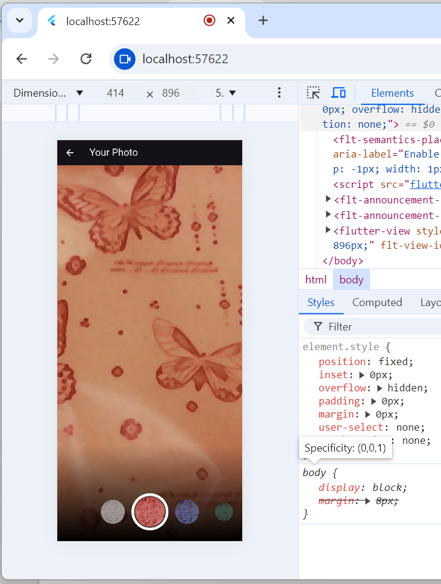

1.

tugas
1.
sempat terjadi erro dibagian navigator dikarenakan tidak suportnya image yangdijalankan melalui web

2.elaskan maksud void async pada praktikum 1?
kata kunci async digunakan untuk memungkinkan penulisankode asinkron yang didalamnya ada penggunaan await.fungsi yang memiliki async memiliki proses yang akan menunggu proses lain selesei seperti menunggu daftar kamera yang tersedia baru akan lanjut ke file takepicture.

3.Jelaskan fungsi dari anotasi @immutable dan @override 
@immutable adalah anotasi yang digunakan untuk menandai bahwa suatu class tidak bisa berubah setelah dibuat selama objek tersebut hidup
@override adalah anotasi yang digunakan untuk method pada class Child(subclass) yang mengimplementasikan dengan nama class yang sama dari class parent(superclass)